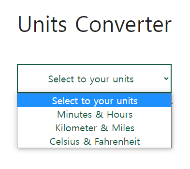
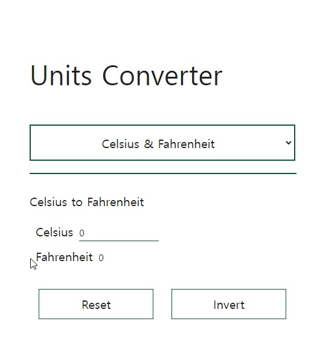
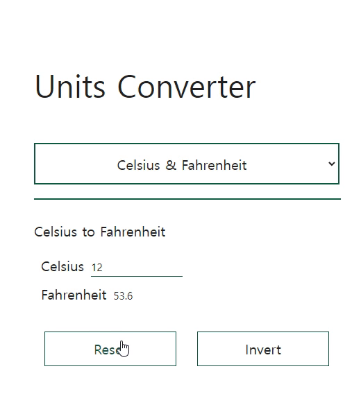

# Units Converter
The units converter made with React.

### **[Start](https://hwahyeon.github.io/reactjs-units-conv/)**

## Fuctions

* Minutes to Hours / Hours to Minutes
* kilometres to miles / miles to kilometres
* Celsius to Fahrenheit / Fahrenheit to Celsius

## Reset / Invert
**Reset** : Make the text box 0

  
  

**Invert** : Change the activity of text boxes to each other

  
